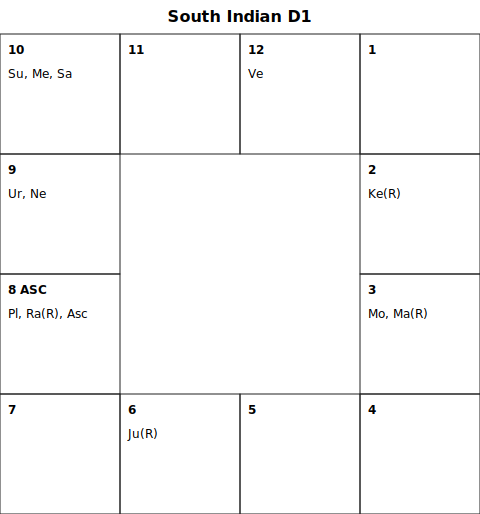
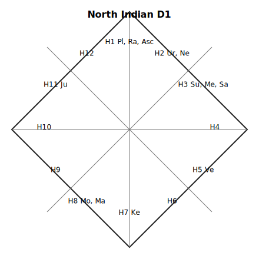
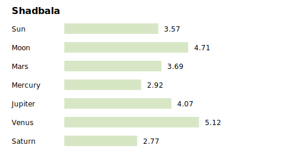

# 印度占星解读报告 — 晴爆爆

> **解读日期**: 2026-07-07
> **系统**: Vedic Divination Engine v0.2.0 · Swiss Ephemeris 2.10.03 · Lahiri 岁差

---

## 一、基本信息

| 项目 | 内容 |
|------|------|
| 性别 | 女 |
| 出生日期 | 1993年2月4日 |
| 出生时间 | 01:50（凌晨） |
| 出生地点 | 山东淄博 (36.81°N, 118.06°E) |
| 时区 | Asia/Shanghai (UTC+8) |
| 岁差系统 | Lahiri (23.76°) |
| 上升星座 | **天蝎座** 2°45' (Vishakha pada 4) |
| 月亮星座 | **双子座** 6°45' (Ardra pada 1) |
| 当前大运 | **木星大运 → 罗睺小运 → 太阳节运** (至 2026-08-21) |

### 五支 (Panchanga)

| 要素 | 内容 |
|------|------|
| Tithi (农历日) | Shukla Dvadashi (白月第十二日) |
| Vara (曜日) | Budhavara / 水曜日 (星期三) |
| Nakshatra (月宿) | Ardra / 参宿 (Rahu 主) |
| Yoga | Yoga 27 |
| Karana | Karana 23 |

---

## 二、星盘总览

### 南印度盘 (D1 — Rasi)

### 北印度盘 (D1 — Rasi)

### 行星分布摘要

| 行星 | 星座 | 宫位 | 度数 | 月宿 | 逆行 |
|------|------|------|------|------|------|
| **上升** | 天蝎 ♏ | 1 | 2°45' | Vishakha p4 | — |
| **太阳** ☉ | 摩羯 ♑ | 3 | 21°10' | Shravana p4 | |
| **月亮** ☽ | 双子 ♊ | 8 | 6°45' | Ardra p1 | |
| **水星** ☿ | 摩羯 ♑ | 3 | 29°13' | Dhanishta p2 | |
| **金星** ♀ | 双鱼 ♓ | 5 | 7°19' | U. Bhadrapada p2 | |
| **火星** ♂ | 双子 ♊ | 8 | 15°46' | Ardra p3 | **R** |
| **木星** ♃ | 处女 ♍ | 11 | 20°53' | Hasta p4 | **R** |
| **土星** ♄ | 摩羯 ♑ | 3 | 26°27' | Dhanishta p1 | |
| **罗睺** ☊ | 天蝎 ♏ | 1 | 26°20' | Jyeshtha p3 | **R** |
| **计都** ☋ | 金牛 ♉ | 7 | 26°20' | Mrigashira p1 | **R** |

### 宫位分布 (Placidus)

| 宫位 | 星座 | 宫主星 |
|------|------|--------|
| 1 宫 (命宫) | 天蝎 ♏ | 火星 |
| 2 宫 (财帛) | 射手 ♐ | 木星 |
| 3 宫 (兄弟/行动) | 摩羯 ♑ | 土星 |
| 4 宫 (家庭/内心) | 水瓶 ♒ | 土星 |
| 5 宫 (创意/子女) | 双鱼 ♓ | 木星 |
| 6 宫 (健康/敌人) | 白羊 ♈ | 火星 |
| 7 宫 (婚姻/合作) | 金牛 ♉ | 金星 |
| 8 宫 (转变/隐秘) | 双子 ♊ | 水星 |
| 9 宫 (运势/信仰) | 巨蟹 ♋ | 月亮 |
| 10 宫 (事业/声望) | 狮子 ♌ | 太阳 |
| 11 宫 (收益/人脉) | 处女 ♍ | 水星 |
| 12 宫 (消融/海外) | 天秤 ♎ | 金星 |

---

## 三、核心格局

### 检测到的 Yoga

#### 1. Gaja Kesari Yoga（象狮瑜伽）— 中等强度
> Jupiter is in a kendra from the Moon

木星在月亮起算的四正宫（Kendra），形成此格。这是一个经典的保护性格局，赋予智慧、声望和克服困难的能力。由于木星落在处女座（落陷），强度被削弱至中等，但仍然在困难时期提供支撑。← 木星在处女座H11 = 月亮双子座H8起算的第4宫（Kendra）

#### 2. Chandra Mangala Yoga（月火瑜伽）— 中等强度
> Moon and Mars conjoin in Gemini

月亮与火星在双子座第8宫合相，形成月火瑜伽。此格赋予强烈的情感驱动力、行动力和财富潜力，但也带来情绪的激烈波动。火星逆行更添一层内化的攻击性——能量向外表达受阻，容易转为内心焦灼或间接表达。← 月亮双子6°45' + 火星双子15°46'(R) 同宫H8

#### 3. Budha-Aditya Yoga（水日瑜伽）— 条件性
> Sun and Mercury occupy the same sign (Capricorn)

太阳与水星在摩羯座第3宫合相，形成智慧型格局。赋予清晰的思维、优秀的表达能力和学习天赋。摩羯座的实际性让这份智慧落地生根——不是空谈，而是有执行力的聪明。← 太阳摩羯21°10' + 水星摩羯29°13' 同在H3

#### 4. Raja Yoga（王者瑜伽）— 条件性
> Kendra and trikona lords are connected

四正宫主与三分宫主产生关联，形成权威型格局。暗示在人生某些阶段会获得地位提升或掌控力。← 需要通过具体宫位连接进一步确认触发时段

#### 5. Viparita Raja Yoga（逆转王瑜伽）— 条件性
> A dusthana lord occupies a dusthana

凶宫主落入凶宫，在吠陀占星中反而是"以毒攻毒"的贵格。困难在后期转化为优势和突破。← 需结合大运触发判断具体表现

#### 6. Kemadruma Yoga（孤月瑜伽）— 中等（部分解除）
> No classical planet occupies the 2nd or 12th sign from Moon

月亮两侧无行星相伴，在古典典籍中暗示情感上的孤独感或人生早期缺乏支持。但此盘有火星与月亮同宫（合相），形成部分解除——不是完全的孤立，而是内心的战斗伙伴。← 月亮双子H8，H2(巨蟹)和H12(金牛)无经典行星，但火星与月亮同宫部分解除

### 行星力量 (Shadbala)

| 行星 | Shadbala (Rupas) | 强度评价 |
|------|------------------|----------|
| **金星** ♀ | 5.12 | ★★★★★ 最强 |
| 月亮 ☽ | 4.71 | ★★★★ 强 |
| 木星 ♃ | 4.07 | ★★★★ 较强 |
| 火星 ♂ | 3.69 | ★★★ 中等 |
| 太阳 ☉ | 3.57 | ★★★ 中等 |
| 水星 ☿ | 2.92 | ★★☆ 偏弱 |
| **土星** ♄ | 2.77 | ★★☆ 最弱 |

**金星以 5.12 Rupas 位居第一**——金星落在双鱼座（擢升），又在第5宫（三分宫），力量充沛。这暗示艺术审美、人际关系和享乐能力是此盘最大的天赋。

**土星以 2.77 Rupas 位居最弱**——尽管土星落在自己守护的摩羯座，但在 Shadbala 六力源的加权计算中表现不佳，暗示在行使权威、承担责任时可能有力不从心之感，或容易过度自我施压。

---

## 四、综合本命解读

### 4.1 性格与自我 (Ascendant + 1H + Moon)

**上升天蝎 + 罗睺同宫 → 强烈的存在感与身份探索**

天蝎座上升本身就带有深度、洞察力和极致倾向。罗睺（北交点）落在第1宫天蝎座，进一步强化了这种"被看见"的渴望——你天生具有让人无法忽视的磁场。但罗睺也带来了身份的不确定感：你可能终其一生都在追问"我是谁"，在不同阶段展现出截然不同的面貌。← 上升天蝎2°45' + 罗睺天蝎26°20'(R) 同在H1

**月亮双子 + Ardra 月宿 → 情绪化的智者**

月亮落在双子座第8宫，Ardra 月宿（由罗睺主掌）赋予敏捷的思维和强烈的好奇心，但也带来情绪上的不安定。你对隐秘事物、心理学、玄学有天然的亲近感（月亮8宫）。情感表达偏理性化——用思考代替感受是你应对情绪冲击的方式。← 月亮双子6°45' Ardra pada 1，落H8

**Atmakaraka 水星 → 灵魂的目标是沟通与表达**

在七重 Karaka 体系中，水星是你的灵魂指示星（Atmakaraka）。此生的核心课题围绕沟通、学习和知识的传递展开。你不是来"默默无闻"的，你是来说话、写作、教学、传播的。← Atmakaraka: Mercury

### 4.2 第三宫群星汇聚——沟通与行动

**太阳 + 水星 + 土星齐聚摩羯座第三宫 → 表达者与实干家**

这是本盘最密集的行星聚集区。三颗行星落在摩羯座第3宫，为沟通、写作、媒体、短途旅行和手足关系注入巨大能量：

- **太阳在3宫摩羯**：自我价值感与表达能力紧密绑定。你在公开表达中获得自信，也可能从事与媒体、出版、传播相关的事业。
- **水星在3宫摩羯（29°临近换座）**：思维结构化、务实，善于将复杂信息整理为清晰逻辑。水星接近摩羯座末尾（29°13'），暗示表达风格正从"严谨务实"向"更开阔的水瓶座思维"进化。
- **土星在3宫摩羯（入庙）**：土星在自己守护的星座中，赋予坚韧的沟通意志。你不是轻轻松松说话的人——你说的每一句话都有分量。但土星也可能让你在年轻时对表达缺乏自信，随着年龄增长逐渐释放。

> ← 太阳摩羯21°10' + 水星摩羯29°13' + 土星摩羯26°27'，三颗均在H3

**Budha-Aditya Yoga（水日瑜伽）在3宫**强化了智力型职业倾向，尤其适合需要深度研究和精确表达的领域。摩羯座的实践性避免了"纸上谈兵"。

### 4.3 第五宫金星擢升——创造力与情感

**金星在双鱼座第5宫擢升 → 艺术灵魂与丰沛情感**

这是本盘最亮眼的配置。金星在双鱼座处于擢升状态（Exalted），且落在第5宫（创意、恋爱、子女、前世福报）：

- 艺术感知力极强，对美的事物有天然的鉴赏力和创造力
- 感情生活中追求浪漫和灵性连接，而非世俗功利
- 第5宫金星擢升也暗示前世修来的福报（Purva Punya），此生自带某种"幸运光环"
- 但双鱼座的消融性可能让感情边界模糊，需要注意分辨真实与幻想

> ← 金星双鱼7°19' Uttara Bhadrapada pada 2，落H5 · Shadbala 5.12 Rupas（全盘最强）

### 4.4 第八宫——深度与转化

**月亮 + 火星（逆行）在双子座第8宫 → 情感战场在深处**

第8宫是吠陀占星中最复杂的宫位之一，掌管转变、隐秘、共享资源、生死、灵性。月亮与逆行火星在此合相：

- 情感经历具有"涅槃重生"的特质——你的人生被几次深刻的情绪转折所定义
- 逆行火星暗示愤怒和行动力向内转化：你不轻易表露攻击性，但内心有巨大的能量储备
- Chandra Mangala Yoga（月火瑜伽）让你在危机时刻反而能爆发惊人的行动力
- 对神秘学、心理学、深度研究的兴趣远超出常人

> ← 月亮双子6°45' + 火星双子15°46'(R) 同在H8

### 4.5 第七宫——关系与合作

**计都落金牛座第7宫 + Darakaraka 火星 → 关系中的独立与超脱**

计都（南交点）在7宫暗示对婚姻和合作关系有一种"出离心"——你不是那种会把全部人生寄托在伴侣身上的人。金牛座计都也暗示在物质和感官享受上容易感到"够了"，有一种知足常乐的态度。

Darakaraka（配偶指示星）为火星，暗示伴侣可能具有火星特质：行动派、直接、有冲劲，但也可能带来关系中的竞争感。

> ← 计都金牛26°20'(R) 落H7 · Darakaraka: Mars

### 4.6 第十一宫——收益与人脉

**木星逆行在处女座第11宫 → 社交圈中的实用主义智慧**

木星落在第11宫（收益、社交圈、愿望实现），但处于处女座（落陷）且逆行。这意味着：

- 社交网络庞大但偏实用导向——你交朋友不是为了热闹，而是有思想和价值观的匹配
- 落陷木星在11宫可能暗示收益来得缓慢但稳定，逆行则让你对"什么样的收益值得追求"有与众不同的标准
- Gaja Kesari Yoga（Jupiter in kendra from Moon）为此提供了保护——即使落陷，木星仍带来贵人和机会

> ← 木星处女20°53'(R) Hasta pada 4，落H11 · Shadbala 4.07 Rupas

---

## 五、大运关键节点

### 当前大运 (截至 2026-07-07)

| 层级 | 行星 | 时段 | 状态 |
|------|------|------|------|
| **Maha** (主运) | 木星 | 2010-12-23 → 2026-12-23 | 最后半年 |
| **Antara** (小运) | 罗睺 | 2024-07-29 → 2026-12-23 | 运行中 |
| **Pratyantar** (节运) | 太阳 | 2026-07-08 → 2026-08-21 | **即将进入** |

**当前解读**：你正处于木星主运的最后半年。木星落在11宫处女座（落陷逆行），这16年的木星大运以"在务实中寻找意义"为主题。当前罗睺小运（2024年中至2026年底）则带来了身份转换、环境变迁、以及对人生方向的重新审视——罗睺在你的第1宫，这段时间你很可能经历了重要的个人转型。

**太阳节运**（2026-07-08 至 2026-08-21）：这是一个短暂的窗口，太阳在第3宫摩羯座，可能带来一个表达自我、展示能力的机会——演讲、写作、或某个需要你站出来的场合。

### 未来关键节点

| 时间 | 大运变化 | 意义 |
|------|---------|------|
| **2026-12-23** | 进入**土星主运** (至 2045-12-23) | 19年土星大运开启，人生进入建设期 |
| 2026-12-23 → 2029-09-25 | 土星/土星 | 土星大运首个小运，根基重筑 |
| 2026-12-23 → 2027-05-13 | 土星/土星/土星 | 土星三重叠加：极度务实、责任加重 |

**土星大运展望**（2026-2035 前10年）：
土星在你的第3宫摩羯座（入庙），即将到来的19年土星主运是此盘最重要的大运周期之一。土星掌管你的第3宫和第4宫，且落在自己守护的摩羯座——这是一个极度重视"建设"的时期。你的沟通能力、专业技能和社会地位将在这个周期中获得实质性的积累。早年的积累（特别是木星大运期间建立的人脉和知识体系）将在土星大运中转化为可见的成果。

> ← 土星摩羯H3入庙 + 土星主运2026-2045 · 水星Atmakaraka + 土星Amatyakaraka 形成人生的实干主轴

---

## 六、七重 Karaka 解读

| Karaka | 行星 | 人生领域 | 解读 |
|--------|------|---------|------|
| **Atmakaraka** | 水星 | 灵魂目标 | 此生的核心课题是沟通、学习和知识分享。你的灵魂通过"表达"来完成进化。 |
| **Amatyakaraka** | 土星 | 事业路径 | 职业生涯与结构、纪律、长期建设相关。土星带给你事业上的耐心和持久力。 |
| **Bhratrikaraka** | 天王星 | 兄弟/同伴 | 与兄弟或亲密伙伴的关系具有独立、反叛的特质。 |
| **Matrikaraka** | 海王星 | 母亲/抚养 | 母亲可能具有艺术气质或灵性倾向，或关系中存在某些模糊边界。 |
| **Putrakaraka** | 太阳 | 子女/创造 | 子女或创意作品将成为你的骄傲和身份象征。 |
| **Gnatikaraka** | 木星 | 障碍/挑战 | 人生障碍往往与信念系统的过度扩张或判断失误有关——但木星也提供解决方案。 |
| **Darakaraka** | 火星 | 配偶 | 伴侣具有主动、直接和行动导向的特质，关系中可能带有竞争或激情元素。 |

---

## 七、总结

### 核心结论

1. **表达是你的天命** — Atmakaraka 水星 + 第3宫三星汇聚 + Budha-Aditya Yoga，一切指向沟通、写作和知识传播作为此生核心课题。你不是旁观者，你是讲述者。← 水星AK + 太阳水星土星摩羯H3

2. **感性丰沛的实干家** — 金星在双鱼座擢升（5宫，全盘最强 Shadbala 5.12）赋予艺术灵魂，而土星在摩羯座入庙（3宫）赋予落地执行的能力。二者看似矛盾，实为此盘最珍贵的组合：你能把梦想建造成现实。← 金星擢升双鱼H5 + 土星入庙摩羯H3

3. **深度情绪的转化者** — 月亮与逆行火星在第8宫形成 Chandra Mangala Yoga，你的人生可能经历数次"烧毁—重生"的情感转折。这些不是创伤，是你力量的来源。← 月亮+火星(R) 双子H8

4. **身份感是终身课题** — 罗睺在上升天蝎座，赋予强烈的个人磁场，但也带来持续的自我追问。你的人生在不同阶段可能展现截然不同的面貌——这本身就是一个"不断蜕变"的星盘配置。← 上升天蝎2°45' + 罗睺1宫

5. **2026年底进入人生建设期** — 木星大运（2010-2026）为你积累了人脉、视野和智慧，即将到来的土星主运（2026-2045）则是将这些积累夯实的19年。未来20年是你事业和人生结构的建设黄金期。← 木星大运→土星大运转换 2026-12-23

### 需要留意的领域

- **情绪健康**（月亮8宫 + Kemadruma 部分影响）：学习正视和处理深层情绪，而非仅用理性压抑。冥想、日记、心理咨询都是有助益的工具。
- **关系的平衡**（计都7宫 + 火星Darakaraka）：在亲密关系中保持独立性的同时，避免过度抽离。学会让伴侣"进来"。
- **避免过度自我施压**（土星Shadbala仅2.77）：尽管土星入庙，但实际力量偏弱，容易给自己加诸过多责任和压力。学会合理设定边界。

---

*本报告由 Vedic Divination Engine 计算星盘 + Claude (吠陀占星知识) 撰写解读。所有结论均基于星盘数据，不构成投资、医疗或法律建议。*
